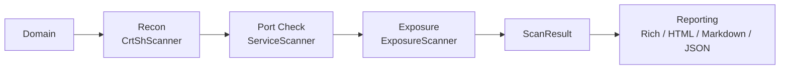

# easm-engine

[](https://github.com/ozkaraonur/easm-engine/actions/workflows/ci.yml)

A modular, asyncio-based **External Attack Surface Management** engine. Give it a domain and it
maps what is exposed to the internet, then tells you what to fix first.

- **Recon**: subdomain discovery from Certificate Transparency logs (crt.sh) plus DNS liveness checks.
- **Port and service detection**: async TCP checks on web ports, then HTTP(S) fingerprinting
  (status, title, server header, TLS validity).
- **Exposure checks**: `.git/HEAD`, `.env`, `backup.zip`, `web.config`, `robots.txt`, `security.txt`,
  with soft-404 protection and content validation to keep false positives low.
- **Reporting**: Rich terminal dashboard, self-contained HTML report, Markdown report, JSON.

Secrets are never reported: `.env` evidence shows `KEY=***` only.

## Architecture



Scanners subclass `BaseScanner`, take a domain and return a `ScanResult`. They never import each
other; `easm/pipeline.py` and the CLI compose them. The `easm/reporting/` package depends only on
the data models.

```
easm/
  core/        models, config, DNS + port helpers, BaseScanner
  scanners/    crtsh.py, services.py, exposures.py
  reporting/   console.py, html.py, markdown.py, summary.py, remediation.py
  pipeline.py  scanner composition
  cli.py       Typer CLI
```

## Installation

Local (Python 3.11+):

```bash
git clone https://github.com/ozkaraonur/easm-engine.git
cd easm-engine
pip install .          # provides the `easm` command
# development: pip install -e ".[dev]"
```

Docker:

```bash
docker build -t easm .
docker run --rm -v "$PWD/output:/reports" easm scan example.com --html report.html
```

or with Compose: `docker compose run --rm easm scan example.com --markdown report.md`

## Quickstart

```bash
easm scan example.com --html report.html --markdown report.md --json result.json
easm subdomains example.com      # discovery only
easm services example.com        # + open ports and web services
easm exposures https://example.com   # exposure checks against one URL
```

No internet access? Run the offline demo, which scans a deliberately leaky local server:

```bash
python examples/run_demo.py      # writes output/demo-report.html and output/demo-report.md
```

Settings can be overridden with `EASM_*` environment variables (for example `EASM_HTTP_TIMEOUT=10`).

## Output

**Terminal dashboard**: a summary panel (subdomains, active hosts, web services, findings), an
open-port distribution, a colour-coded findings-by-severity table and a detailed findings table.

```
+- EASM summary: example.test -+
| Subdomains    1 (1 active)   |
| Web services  1              |
| Findings      3              |
+------------------------------+
| Severity | Count |
| CRITICAL |     2 |
| INFO     |     1 |
```

**HTML report**: one self-contained file (embedded CSS, no external assets, light/dark aware). It
opens with an Executive Summary (overall risk, counts per severity), followed by the discovered
assets table and one card per finding with URL, evidence and remediation advice. All scan data is
HTML-escaped. The **Markdown report** has the same structure for tickets and wikis.

## Development

```bash
pytest
ruff check . && ruff format --check .
mypy --strict easm
```

CI runs these on Python 3.11 and 3.12 for every push and pull request.

## Ethical use and disclaimer

Only scan domains and systems you own or have explicit written permission to test. The exposure
checks send real HTTP requests to the target. Unauthorized scanning may be illegal in your
jurisdiction. This software is provided "as is", without warranty; the authors accept no
liability for misuse or for damage resulting from its use. You are solely responsible for how you
use it.
