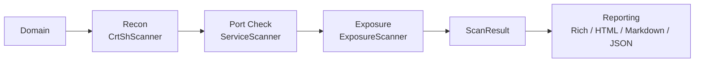
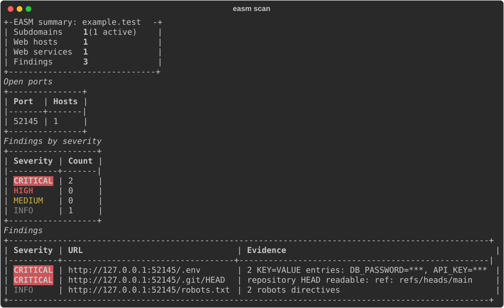
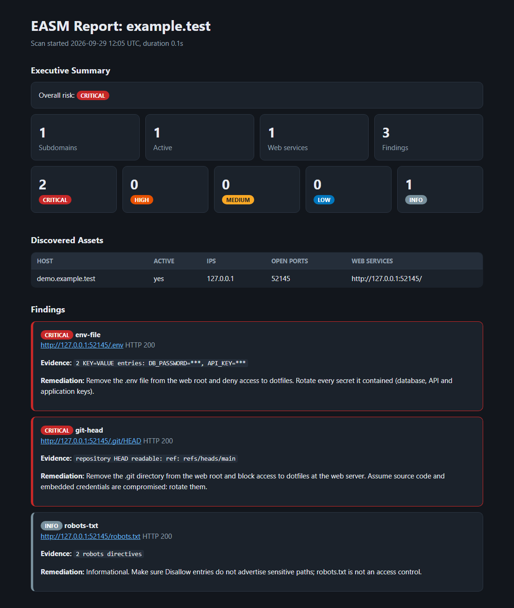

# easm-engine

[](https://github.com/ozkaraonur/easm-engine/actions/workflows/ci.yml)

A modular, asyncio-based **External Attack Surface Management** engine. Give it a domain and it
maps what is exposed to the internet, then tells you what to fix first.

- **Recon**: subdomains from Certificate Transparency (crt.sh), HackerTarget and a DNS wordlist
  (wildcard-aware), merged and checked for DNS liveness. A failing source never aborts the scan.
- **Ports and services**: async TCP checks on web ports plus risky ones (SSH, RDP, SMB, databases,
  Redis, Elasticsearch...), passive banner grabbing, and HTTP(S) fingerprinting (status, title,
  server header, TLS validity). Open risky ports become findings.
- **Exposure checks**: 27 checks (`.git`, `.env`, SQL dumps, backups, keys, `phpinfo`, directory
  listings, actuator/Swagger...) with soft-404 protection and content validation.
- **Risk score**: 0-100 from findings, invalid TLS and end-of-life server software.
- **Reporting**: Rich terminal dashboard, self-contained HTML report, Markdown report, JSON.

Secrets are never reported: `.env` evidence shows `KEY=***` only.

## Architecture



Scanners subclass `BaseScanner`, take a domain and return a `ScanResult`. They never import each
other; `easm/pipeline.py` and the CLI compose them. The `easm/reporting/` package depends only on
the data models.

```
easm/
  core/        models, config, DNS + port helpers, BaseScanner
  scanners/    crtsh.py, services.py, exposures.py
  reporting/   console.py, html.py, markdown.py, summary.py, remediation.py
  pipeline.py  scanner composition
  cli.py       Typer CLI
```

## Installation

Local (Python 3.11+):

```bash
git clone https://github.com/ozkaraonur/easm-engine.git
cd easm-engine
pip install .          # provides the `easm` command
# development: pip install -e ".[dev]"
```

Docker:

```bash
docker build -t easm .
docker run --rm -v "$PWD/output:/reports" easm scan example.com --html report.html
```

or with Compose: `docker compose run --rm easm scan example.com --markdown report.md`

## Quickstart

```bash
easm scan example.com --html report.html --markdown report.md --json result.json
easm subdomains example.com      # discovery only
easm services example.com        # + open ports and web services
easm exposures https://example.com   # exposure checks against one URL
easm web                         # Streamlit dashboard (alias: easm ui) on http://127.0.0.1:8501
```

No internet access? Run the offline demo, which scans a deliberately leaky local server:

```bash
python examples/run_demo.py      # writes output/demo-report.html and output/demo-report.md
```

Settings can be overridden with `EASM_*` environment variables (for example `EASM_HTTP_TIMEOUT=10`).

## Sample output

Generated by `python examples/run_demo.py --svg assets/dashboard.svg` against a local test server.

### Terminal dashboard

Summary panel, open-port distribution and a colour-coded severity table, ready for a terminal
session or a screen share.



### HTML report

A single self-contained file (embedded CSS, no external assets, light/dark aware) that can be
attached to an email or a ticket as is.



| Section | What the reader gets |
| --- | --- |
| **Executive Summary** | Overall risk rating, counts of subdomains, active hosts, web services and findings, and a per-severity breakdown. Written for management. |
| **Discovered Assets** | Every host with liveness, IPs, open ports and the web services found on it. Hosts with web services are listed first. |
| **Findings and Remediation** | One card per finding, most severe first: URL, HTTP status, redacted evidence and a concrete remediation step. Written for engineers. |

The Markdown report (`--markdown`) has the same structure for wikis and pull requests, and
`--json` exports the full machine-readable result. All scan data is escaped in the HTML output.

## Development

```bash
pytest
ruff check . && ruff format --check .
mypy --strict easm
```

CI runs these on Python 3.11 and 3.12 for every push and pull request.

## Ethical use and disclaimer

Only scan domains and systems you own or have explicit written permission to test. The exposure
checks send real HTTP requests to the target. Unauthorized scanning may be illegal in your
jurisdiction. This software is provided "as is", without warranty; the authors accept no
liability for misuse or for damage resulting from its use. You are solely responsible for how you
use it.
